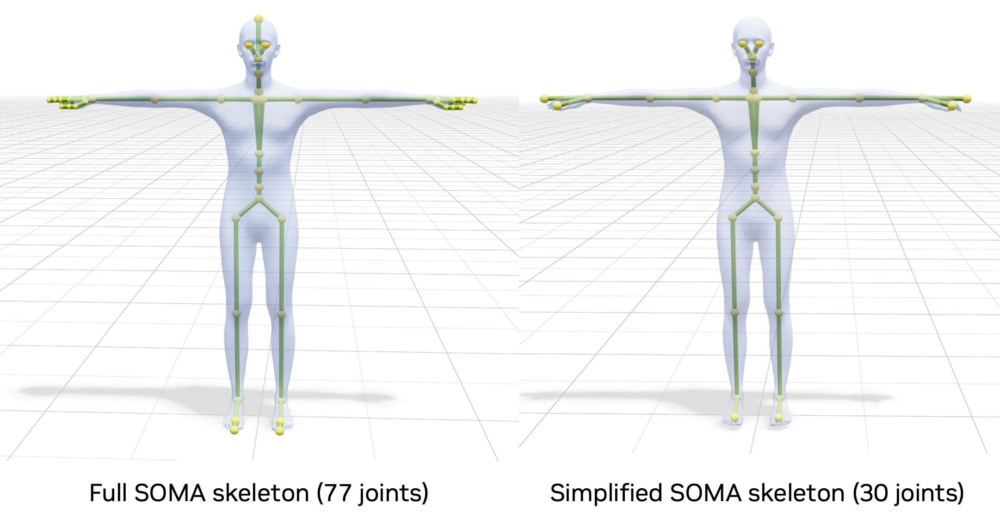

# Skeletons

Different versions of Kimodo support different skeletons (character). A separate model is trained for each skeleton, with the
currently available options being [SOMA](https://github.com/NVlabs/SOMA-X), [G1](https://github.com/unitreerobotics/unitree_mujoco/tree/main/unitree_robots/g1), and [SMPL-X](https://github.com/vchoutas/smplx).

The skeletons discussed on this page are defined in `kimodo/skeleton/definitions.py`.

## SOMA (default)

SOMA is the default skeleton used for Kimodo. It it based on the [SOMA body model](https://github.com/NVlabs/SOMA-X), which is also used in the [BONES-SEED dataset](https://huggingface.co/datasets/bones-studio/seed).
Kimodo uses two closely related SOMA skeleton definitions:

- **`somaskel30`**: the reduced 30-joint skeleton used internally by the model and by the core SOMA constraint formulation. It removes most finger and hand detail.
- **`somaskel77`**: the full 77-joint SOMA skeleton used for public-facing visualization and SOMA motion exports.

In practice, Kimodo predicts SOMA motions on `somaskel30` and converts them to `somaskel77` when returning or visualizing results in the demo. Older assets and examples may still be stored on `somaskel30`, and the tooling keeps backward compatibility with those files.

Note that all training data for Kimodo is on a uniform skeleton proportion corresponding to one single set of identity parameters for the SOMA body model.

Outputs on the SOMA skeleton can be visualized in two ways. The first is by articulating a fixed SOMA rig and doing traditional skinning (corresponds to `kimodo/viz/soma_skin.py` in the codebase).
Alternatively, we can take generated joint rotations and feed them through the SOMA layer with the set of identity parameters that correspond to the body shape of our uniform skeleton. An example of this in the codebase at `kimodo/viz/soma_layer_skin.py`, which uses the identity parameters defined from `kimodo/assets/skeletons/somaskel30/soma_base_fit_mhr_params.npz` (the same ones from BONES-SEED data).

Due to peculiarities with data processing, using the SOMA rig and SOMA layer give very slightly different results in visualization, with the SOMA rig better reflecting the data that Kimodo was trained on.

## Unitree G1

The G1 skeleton targets MuJoCo-compatible exports and robotics workflows.
The version that Kimodo uses is a 34-joint skeleton, with extra joints added for the toes to ease learning. When generated motions are exported to the MuJoCo `qpos` CSV format, these joints are removed to be compatible with downstream applications.

## SMPL-X

This aligns with the SMPL-X model and supports AMASS-style exports. It uses 22 joints corresponding to only the body joints. This option is useful for compatibility with SMPL-X pipelines or downstream tools expecting AMASS parameters, but it is **not** the recommended Kimodo model to use since generated motions may display particularly severe retargeting artifacts.

